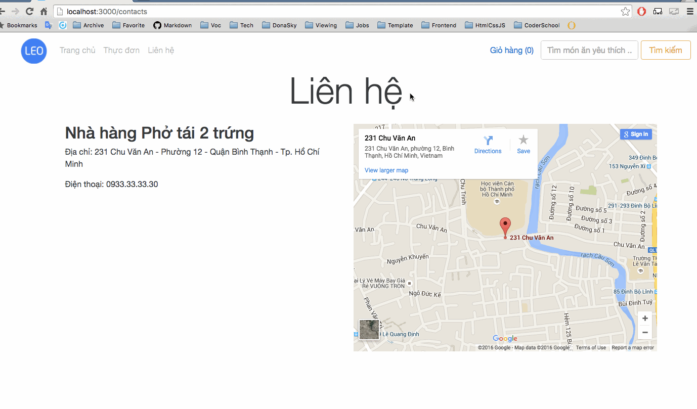

# Phở tái 2 trứng Website

**Phở tái 2 trứng** is a Ruby on Rails restaurant website let users order foods.

Submitted by: Leo Le

Time spent: **21** hours spent in total

URL: **thawing-shore-51560.herokuapp.com**

## User Stories

### Required:

* [x] User must be able to go two pages: Menu, and Contact Us.
* [x] User can see the address and phone number on the contact us page.
* [x] User can see a basic google map on the Contact Us page.
* [x] User can navigate to a menu page with four sections:
  * [x] Breakfast
  * [x] Lunch
  * [x] Dinner
  * [x] Drinks
* [x] User should see at least 5 food items in each section.
* [x] Each food item should have the following fields:
  * Name (Canh Chua)
  * Description (Delicious fish soup)
  * Price (VND)
  * Section - Breakfast, Lunch, Dinner, Drinks
  * Image URL - do a google search or use LoremFlickr: http://loremflickr.com/320/240/canhchua
* [x] User should be able to filter by section of Breakfast, Lunch, Dinner, or Drinks and see only the relevant items.
* [x] User can sort menu items by “alphabetical”, “price low to high”, and “price high to low”.
* [x] User should be able to get for a menu item and see results.
* [x] Clicking on an item in the menu brings up its detail, where you see the description and a larger picture.
* [x] User can click “order” on a menu item to go to a “Create Order” page.
* [x] User is able to fill in their name, phone number, and address.
* [x] User is taken to a “Thank you for your order page” that lists the name of item, the total cost (delivery should cost 20,000 VND), the user’s name, the user’s address, and the time the order was created in human-readable format (for example, Tuesday, December 1, 15:25).

### Optional:

* [ ] User can also filter by type of Cuisine.
* [x] User can see how many times each menu item has been viewed, and sort items by “most viewed”.
* [x] User can leave a review (1-5 stars) for each dish, along with a text review.
* [x] User can see reviews and an average review score.
* [x] User can input "CODERSCHOOL" as a coupon code on the order page, which should give a 50% discount off of the order.
* [x] User can order more than one dish at a time.
* [ ] User receives an email upon placing an order.
* [ ] The Restaurant (you) receives an email or SMS when a User places an order. Try Twilio if you’d like a SMS API. Use Promo Code CodeSchool15 for $30 free credit.

The following **additional** features are implemented:

* [x] Can search food item by Vietnamese name or English name
* [x] Quantity of food item in order

The following **known issues**:

* I got problem with the javascript. Particularly, I tried to apply the onClick event in <tr> component so that user can click on one row in order to open the item details. However, the javascript function didn't work at the first time I visited the page until I refresh it. I research the problem and maybe it is related to the turbolinks library. I removed the turbolinks but it didn't work anymore. (you can find more about these discusssions [here](http://stackoverflow.com/questions/17317816/rails-javascript-only-works-after-reload) or [here](http://stackoverflow.com/questions/27750863/rails-javascript-only-loads-when-you-refresh-page-not-on-the-original-page-load))

## Video Walkthrough

Here's a walkthrough of implemented user stories:

## Notes

* I have difficulty in working with relationship/association models and form helper with nested attributes.

## License

    Copyright [2016] [Leo Le]

    Licensed under the Apache License, Version 2.0 (the "License");
    you may not use this file except in compliance with the License.
    You may obtain a copy of the License at

        http://www.apache.org/licenses/LICENSE-2.0

    Unless required by applicable law or agreed to in writing, software
    distributed under the License is distributed on an "AS IS" BASIS,
    WITHOUT WARRANTIES OR CONDITIONS OF ANY KIND, either express or implied.
    See the License for the specific language governing permissions and
    limitations under the License.
